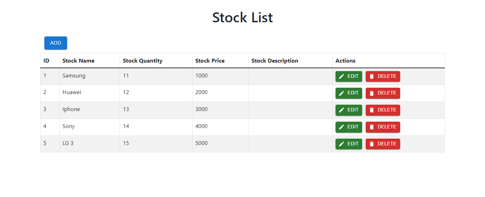

# Commsult Project Test
## Specification
- React Framework: [Next js](https://nextjs.org/)
- Java Framework: [Spring boot](https://spring.io/projects/spring-boot)
  - Plugins:
    - Spring Web
    - Spring Boot DevTools
    - Spring Data JPA
    - Spring Security
    - MYSQL Driver
    - Validation I/O
 
- Database: [MySQL](https://www.mysql.com/)
- UI Library: [Material UI](https://mui.com/)
- Dev Tools:
  - [VSCode](https://code.visualstudio.com/)
  - [Postman](https://www.postman.com/)
  - [Docker](https://www.docker.com/)

## Screenshoot

## References
- [Commsult](https://www.google.com/url?sa=i&url=https%3A%2F%2Fid.linkedin.com%2Fcompany%2Fcommsult-ag&psig=AOvVaw2uZhN2vgnakrJCVNZPh9gL&ust=1637253231638000&source=images&cd=vfe&ved=0CAsQjRxqFwoTCKDbpd3pn_QCFQAAAAAdAAAAABAi)
- Markdown Cheatsheet by [Adam Priatchard](https://github.com/adam-p/markdown-here/wiki/Markdown-Cheatsheet#links)
- [Freepik](https://www.freepik.com)
- [Colorhunt](https://colorhunt.co/palettes/popular)
